# 🚀 Engineering Projects Showcase

A curated catalog of production systems, SaaS platforms, enterprise ERPs, and specialized APIs engineered and architected by **Yashin Chauhan**.

---

## 📌 Featured Projects Portfolio

| Project | Domain / Industry | Core Tech Stack | Architectural Highlights | Showcase Document |
| :--- | :--- | :--- | :--- | :--- |
| **🏠 RentKhata** | PropTech / Co-Living SaaS | `Next.js 15`, `NestJS 11`, `React Native (Expo 52)`, `PostgreSQL`, `Prisma 7`, `Redis` | Double-entry financial ledger (integer paise), multi-tenant property hierarchy, sub-meter utility billing, tenant self-service portal | [View Deep Dive ➔](./rentkhata.md) |
| **🚚 Compass Transport** | Freight Logistics & Supply Chain | `PHP 8`, `Laravel 8`, `MySQL 8`, `Blade`, `DomPDF`, `Laravel-Excel` | Multi-branch session isolation (`DLI` vs `UMB`), dynamic counter bilty billing, payment-status GST allocation, high-fidelity vector PDF generation | [View Deep Dive ➔](./compass-transport.md) |
| **💎 Gems Testing India** | Gemology & Authenticity Verification | `PHP 8.1+`, `Laravel 10`, `MySQL 8`, `DomPDF 2.0`, `Yajra DataTables` | Sub-8ms multi-table SQL `UNION` lookup engine, 4-tier division schema (Gems, Diamonds, Jewelry, Rudraksha), exact millimeter PVC card PDF engine | [View Deep Dive ➔](./gems-testing-india.md) |
| **🌾 Pragya Crop Advisory** | AgriTech & Grassroots NGO | `PHP 8.1+`, `Laravel 10`, `MySQL 8`, `RESTful API`, `UTF-8 Bilingual Engine` | 12-stage crop lifecycle modeling, composite joins for pest/disease IPM diagnostics, dynamic mobile taxonomy, bilingual Devanagari normalizer | [View Deep Dive ➔](./pragya-crop-advisory.md) |

---

## 🏗️ Comparative Architecture Matrix

```mermaid
flowchart TD
    subgraph EnterpriseSaaS["PropTech SaaS (RentKhata)"]
        RK_FE["Next.js 15 Web + Expo 52 Mobile"]
        RK_BE["NestJS 11 Fastify + Prisma 7"]
        RK_DB[("PostgreSQL (Supabase) + Redis")]
        RK_FE --> RK_BE --> RK_DB
    end

    subgraph LogisticsERP["Logistics ERP (Compass Transport)"]
        CT_FE["Blade + CoolAdmin + jQuery"]
        CT_BE["Laravel 8 MVC + DomPDF + Excel"]
        CT_DB[("MySQL 8 (Branch Isolated)")]
        CT_FE --> CT_BE --> CT_DB
    end

    subgraph LabVerification["Laboratory Verification (GTI)"]
        GTI_FE["Public AJAX Lookup + Yajra DataTables"]
        GTI_BE["Laravel 10 Engine + Union Query Helper"]
        GTI_DB[("MySQL 8 (4-Tier Schema)")]
        GTI_FE --> GTI_BE --> GTI_DB
    end

    subgraph AgriTechAPI["AgriTech API (Pragya Platform)"]
        PA_FE["Farmer Mobile Apps (Android/iOS)"]
        PA_BE["Laravel 10 REST API Gateway"]
        PA_DB[("MySQL 8 (Relational Agronomy)")]
        PA_FE --> PA_BE --> PA_DB
    end
```



---

## 🛠️ Technology Breakdown

```
├── Languages: TypeScript, JavaScript (ES6+), PHP (7.4, 8.x, 8.1+), SQL, HTML5, CSS3
├── Frameworks & Libraries: Next.js (14/15 App Router), React 19, NestJS 11, Fastify 5, React Native (Expo 52), Laravel (8.x & 10.x), Express.js
├── Databases & ORM: PostgreSQL (Supabase, Pooling), MySQL 8.x, MongoDB, Prisma 7, Eloquent ORM
├── Caching & Async: Redis, BullMQ Background Queues
├── Document & Reporting Engines: Barryvdh DomPDF (Print-exact Vector Cards & Bilties), Maatwebsite Laravel-Excel
├── DevOps & Cloud: Cloudflare (WAF/DNS), Nginx Reverse Proxy, Oracle Cloud Infrastructure, PM2, Git, GitHub Actions
```

---

## 📂 Quick Project Navigation

1. **[RentKhata Architectural Deep-Dive](./rentkhata.md)**
   * Multi-tenant property inventory modeling
   * Append-only double-entry ledger & integer paise calculations
   * Contract-first OpenAPI client code generation
   * Microservice-ready modular architecture

2. **[Compass Transport Architectural Deep-Dive](./compass-transport.md)**
   * Regional branch context partitioning & ID prefixes
   * Real-time counter bilty drafting & live client auto-completion
   * GST compliance engine based on consignment terms (`PAID` vs `TO PAY`)
   * Consolidated consignee statement vouchers

3. **[Gems Testing India Architectural Deep-Dive](./gems-testing-india.md)**
   * Universal single-index search resolving across 4 polymorphic laboratory models in <8ms
   * Vector PVC card generation pipeline with custom print stylesheets
   * Asynchronous server-side Yajra DataTables integration
   * Granular batch Excel import validator

4. **[Pragya Crop Advisory Architectural Deep-Dive](./pragya-crop-advisory.md)**
   * Comprehensive 12-stage agricultural decision tree
   * High-performance composite joins for disease & pest mitigation
   * Dynamic taxonomy decoupling mobile app UI from app-store binary updates
   * Devanagari Unicode (`utf8mb4`) and English bilingual data pipeline

---

*For technical inquiries, architectural discussions, or collaboration, feel free to reach out via [GitHub](https://github.com/yashin-chauhan) or [Email](mailto:yashin123786@gmail.com).*
