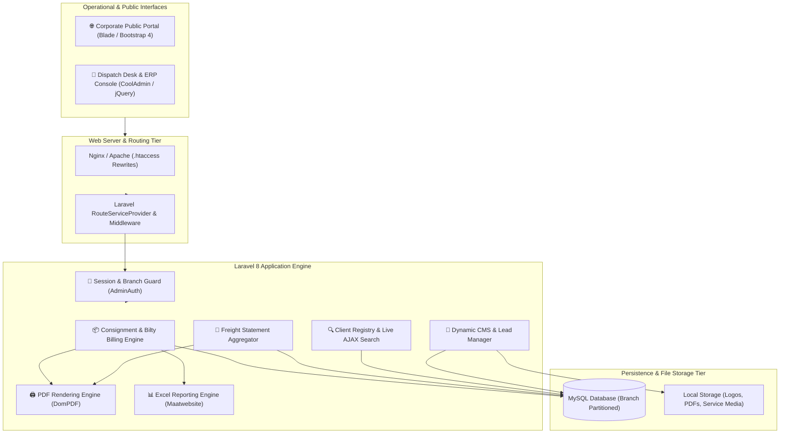

# 🚚 Compass Transport — Regional Logistics ERP & Freight Management Platform

> **A multi-branch freight billing, consignment management, and automated documentation system engineered for Indian road logistics and transport operators.**

🔗 **Showcase Repository:** [github.com/yashin-chauhan/compass-transport-showcase](https://github.com/yashin-chauhan/compass-transport-showcase)  
🌐 **Live Platform:** [compasstransport.in](https://compasstransport.in/)

---

## 💡 Problem Context & Business Domain

Regional road transport and logistics companies across North India (e.g., Delhi, Ambala, Guwahati corridors) encounter severe operational friction:

* **Manual Lorry Receipts (Bilties):** Clerks generate multi-part physical bilties by hand, resulting in calculation errors, misplaced consignment slips, and delayed billing cycles.
* **Multi-Branch Data Fragmentation:** Operating hubs across state lines (Delhi & Haryana) with distinct tax regimes, bill series, and local dispatch rules leads to number collisions.
* **Tedious Statement Reconciliation:** Generating periodic billing statements for corporate clients requires manually auditing dozens of physical receipts.
* **GST Liability Allocation Complexity:** Shifting tax compliance rules between *Consignor* (Paid) and *Consignee* (To Pay) create frequent accounting reconciliation discrepancies.

---

## 🚀 The Solution & System Architecture

Compass Transport integrates operational dispatch counters, branch managers, and accounting auditors into a unified platform:

---

## 🧩 Core Platform Subsystems

| Subsystem | Tech Stack | Architectural Function |
| :--- | :--- | :--- |
| **Dynamic Consignment (Bilty) Engine** | Laravel 8, Blade, jQuery, MySQL | High-speed counter billing for multi-item consignments with live JavaScript line calculations and tax allocations. |
| **PDF Document Rendering Engine** | `barryvdh/laravel-dompdf`, CSS Print | On-the-fly generation of print-exact, vector-sharp Lorry Receipts and freight statement vouchers in <300ms. |
| **Consolidated Statement Engine** | Eloquent ORM, MySQL Aggregations | Bundles dozens of regional shipments into a single invoice voucher with settlement status tracking. |
| **Live Client Directory & Autocomplete** | jQuery AJAX, MySQL Full-Text Search | Instant lookup for consignor and consignee profiles, addresses, and GSTINs to accelerate dispatch throughput. |
| **Audit Excel Reporting Engine** | `maatwebsite/excel` (Laravel-Excel 3.1) | Filtered batch export of consignment registers by branch and date range for financial audits. |
| **Public Portal & Inquiries** | Bootstrap 4, Blade, Owl Carousel | Responsive corporate website with dynamic service listings and customer lead-capture pipeline. |

---

## 🛡️ Key Engineering Highlights & Domain Invariants

### 1. Zero-Friction Counter Billing with Dynamic Line Items
* Dispatch clerks process mixed-cargo freight containing varied packaging types and per-piece/per-weight tariffs.
* The interface dynamically generates line items and performs real-time browser-side calculations for subtotal, bilty charges, cartage, door delivery fees, and grand totals with zero round-trip lag.

### 2. Multi-Branch Context Partitioning
* Branch context (`delhi` vs `ambala`) is derived securely from the authenticated administrator session.
* Dispatches are isolated into regional tables (`bills`/`products` with `DLI-` prefix vs `bills_ambala`/`products_ambala` with `UMB-` prefix) to prevent serial numbering collisions across regional offices.

### 3. Smart Payment-Status Driven GST Allocation
In accordance with Indian transport tax standards, the system dynamically shifts the designated GST payer based on freight terms:
* **`PAID`**: Sets designated GST liability to the **Consignor**.
* **`TO PAY`**: Automatically assigns GST liability to the **Consignee**.

### 4. High-Fidelity Vector PDF Generation
* Custom CSS print stylesheets ensure generated Lorry Receipts fit standard transport station stationery with exact margins and crystal-clear vector fonts.

---

## 👨‍💻 Engineering Ownership

As the Full-Stack Software Engineer on this project, I was responsible for:
* Architecting and developing the complete backend application in **Laravel 8 & MySQL**.
* Designing the real-time dynamic bilty calculation workflow and AJAX client auto-completion.
* Building the vector PDF generation templates for consignment notes and financial statements with **DomPDF**.
* Implementing multi-branch session isolation for regional dispatch centers.
* Developing the responsive corporate public web portal and inquiry management engine.
