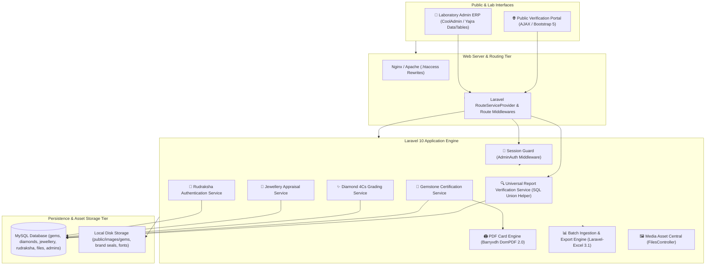

# 💎 Gems Testing India (GTI) — Gemological Laboratory Management & Verification Platform

> **A multi-division gemstone authentication, physical certificate generation, and instant public verification platform engineered for professional gemological laboratories.**

[](https://www.php.net/)
[](https://laravel.com/)
[](https://www.mysql.com/)
[](https://getbootstrap.com/)
[](https://github.com/barryvdh/laravel-dompdf)
[](https://laravel-excel.com/)
[](https://yajrabox.com/)

🔗 **Showcase Repository:** [github.com/yashin-chauhan/gems-testing-india-showcase](https://github.com/yashin-chauhan/gems-testing-india-showcase)

---

## 💡 Problem Context & Business Domain

The gemstone, diamond, and fine jewelry market in India depends on authenticated physical certificates. Traditional gem testing laboratories face critical operational hurdles:

* **Certificate Forgery & Tampering:** Paper certificates can be easily photocopied or forged, damaging consumer confidence and jeweler reputations.
* **Multi-Category Attribute Complexity:** Testing diverse specimens—from colored gemstones and 4Cs certified diamonds to finished studded jewelry and sacred Rudraksha beads—requires distinct scientific schemas (Refractive Index, Specific Gravity, Carat weight, Mukhi count, Diamond net weight).
* **Manual Card Alignment Delays:** Designing individual PVC certificate cards manually in graphic software causes severe delivery delays during peak testing volume.
* **Lack of Instant Public Verification:** Jewelers and consumers lack a fast, mobile-friendly way to verify certificate authenticity on retail counters.
* **Tedious High-Volume Ingestion:** Entering hundreds of stone test results individually creates bottlenecks during major gem trade shows and auctions.

---

## 🚀 The Solution & Platform Architecture

GTI provides an integrated laboratory ERP, public verification engine, and print-exact certificate generator:



---

## 🧩 Core Platform Subsystems

| Subsystem | Tech Stack | Architectural Function |
| :--- | :--- | :--- |
| **Universal Report Lookup** | Laravel 10, Eloquent `UNION`, jQuery AJAX | Single search input resolving report numbers across 4 distinct database tables in <8ms with modal rendering. |
| **PDF Certificate Engine** | `barryvdh/laravel-dompdf 2.0`, Base64 Assets | Generates print-ready physical PVC certificate cards ($400 \times 590\text{ pt}$) with watermarks and embedded macro photos. |
| **Multi-Division ERP** | Laravel Controllers, Blade, Yajra DataTables | Full administrative lifecycle management (CRUD) for Gems, Diamonds, Jewellery, and Rudraksha records. |
| **Bulk Data Ingestion** | `maatwebsite/excel` (Laravel-Excel 3.1) | Batch `.xlsx` and `.csv` importing with automated row validation and error summary reporting. |
| **Media Asset Hub** | PHP File API, Clipboard JS, MySQL | Centralized image repository supporting quick image uploads and one-click clipboard filename copying for bulk workflows. |
| **Public Portal & Inquiries** | Bootstrap 5, Blade, CSS Animations | Responsive customer portal showcasing testing methodologies, laboratory standards, and customer inquiry forms. |

---

## 🛡️ Key Engineering Highlights & Invariants

### 1. High-Performance Multi-Table SQL UNION Lookup (<8ms)
Rather than executing multiple sequential queries or maintaining complex polymorphic relationships across diverse scientific datasets, the engine implements a unified `UNION` query helper:
```php
function getProductIdAndType($report_id) {
    return DB::table('gems')->select('id', 'type')->where('report_number', $report_id)
        ->union(DB::table('diamonds')->select('id', 'type')->where('report_number', $report_id))
        ->union(DB::table('rudraksha')->select('id', 'type')->where('report_number', $report_id))
        ->union(DB::table('jewellery')->select('id', 'type')->where('report_number', $report_id))
        ->first();
}
```
* Enables instant single-index resolution in under **8ms**, directly routing to the target model view without unnecessary database overhead.

### 2. Print-Exact Landscape PVC Card PDF Rendering
* Physical gemstone certificates require millimeter-accurate alignment for thermal PVC card printers.
* Custom DomPDF configuration with explicit viewport sizing (`[0, 0, 400, 590]` pt in landscape) and **Base64-embedded graphics** eliminates network fetching latency during batch card rendering.

### 3. Asynchronous Yajra DataTables Integration
* Admin tables handle thousands of historical test records with asynchronous server-side search, sorting, and pagination.

### 4. Robust Granular Excel Ingestion Pipeline
* Custom row validators for each testing category detect invalid data rows and provide row-by-row failure reports without failing entire batch transactions.

---

## 👨‍💻 Engineering Ownership

As the Full-Stack Software Engineer on this project, I was responsible for:
* End-to-end architecture, database schema design, and Laravel 10 backend development.
* Engineering the universal multi-table search helper and AJAX modal verification pipeline.
* Designing and implementing the print-exact DomPDF certificate card generation engine.
* Developing the bulk Excel import/export pipelines with validation handlers.
* Integrating Yajra DataTables for interactive, high-performance inventory management.
* Crafting responsive Blade templates, brand styling, and media upload workflows.
