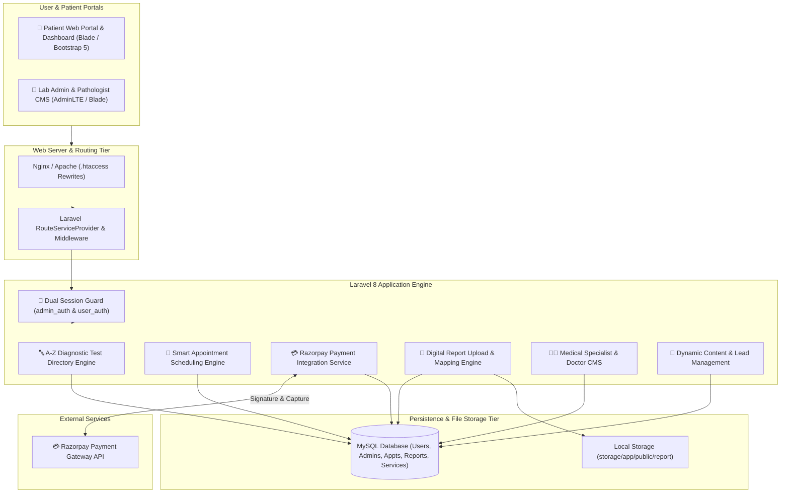
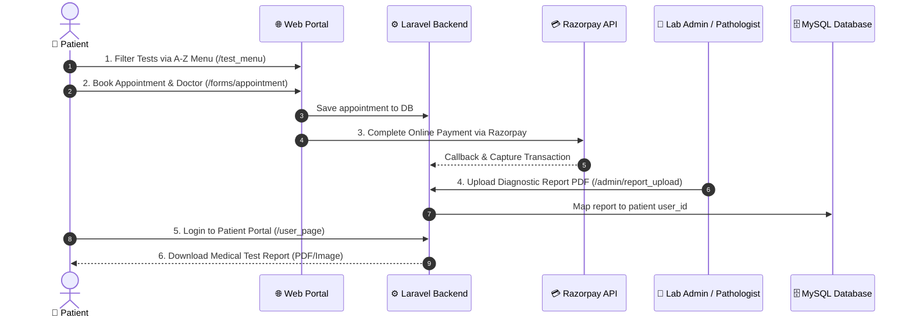

# 🩺 Medilab — Diagnostic Pathology Laboratory & Healthcare Management System

> **A full-stack clinical laboratory management platform featuring an A-Z diagnostic test directory, online appointment booking, Razorpay payment gateway integration, digital report delivery, and an administrative back-office CMS.**

🔗 **Showcase Repository:** [github.com/yashin-chauhan/pathology-lab-management-showcase](https://github.com/yashin-chauhan/pathology-lab-management-showcase)

---

## 💡 Problem Context & Clinical Domain

Standalone diagnostic pathology clinics and regional healthcare laboratories encounter severe workflow and patient-handling challenges:

* **Unorganized Diagnostic Test Menus:** Patients face difficulty finding available pathology tests, required sample conditions (e.g. 12-hour fasting), and current test rates.
* **Reception Desk Congestion:** Manual paper appointment booking and cash counters create long patient queues and scheduling errors.
* **Physical Report Collection Overhead:** Patients are required to make inconvenient physical return trips to the clinic solely to collect printed paper lab reports.
* **Cash Reconciliation Overhead:** Manual counter transactions complicate daily accounting, auditing, and refund tracking.

---

## 🚀 The Solution & System Architecture

Medilab bridges patients, laboratory technicians, and pathologists through a unified digital platform:

---

## 🧩 Core Platform Subsystems

| Subsystem | Tech Stack | Architectural Function |
| :--- | :--- | :--- |
| **Interactive A-Z Test Search Engine** | Laravel 8, Blade, JavaScript | Real-time alphabetical filtering (A–Z) across clinical tests (CBC, Thyroid, Lipid Profile) with dynamic pricing and sample rules. |
| **Razorpay Payment Gateway** | `razorpay/razorpay: ^2.8`, REST API | Handles online fee transactions, signature verification, and automated payment capture with session flash feedback. |
| **Patient Portal & Dashboard** | Laravel Session (`user_auth`), Blade | Personal patient dashboard for managing health profiles, appointment status, and real-time medical report downloads. |
| **Digital Report Delivery Engine** | Laravel Storage, Symlink, MySQL | Lab technicians upload diagnostic PDF/image reports mapped securely to patient `user_id` records. |
| **Smart Appointment Scheduler** | Blade Forms, Eloquent ORM, MySQL | Scheduling workflow supporting department and doctor selection, booking queues, and cancellation management. |
| **Admin Back-Office CMS** | Laravel Middleware (`admin_auth`), Bootstrap | Comprehensive administrative CMS for managing diagnostic test catalogs, pricing, doctor rosters, and patient records. |

---

## 🛡️ Key Engineering Highlights & Domain Invariants

### 1. Dynamic A-Z Alphabetical Search Engine
* Patients can browse hundreds of pathology tests using an interactive 26-letter index strip.
* The backend executes prefix filtering (`WHERE name LIKE 'A%'`) to deliver instant test information, fees, and sample preparation guidelines without heavy client payloads.

### 2. End-to-End Digital Report Delivery System
* Eliminates physical collection trips by enabling pathologists to upload digital diagnostic reports directly to a patient's record.
* Uploaded files are timestamped, sanitized, and stored securely in `storage/app/public/report/`, exposed via symlink, and bound strictly to `session('USER_ID')` to guarantee patient confidentiality.

### 3. Real-Time Razorpay Payment Integration
* Direct API integration with the Razorpay PHP SDK for capturing consultation and laboratory test fees.
* Includes signature verification, transaction logging, and robust error handling to prevent double billing or dropped appointments.

### 4. Dual-Guard Session Authentication Architecture
* Segregated security boundaries separating administrative operations from patient self-service.
* Employs `admin_auth` and `user_auth` custom middlewares with Bcrypt password hashing to protect patient health records (PHI).

---

## 🔄 Diagnostic & Patient Lifecycle Flow

