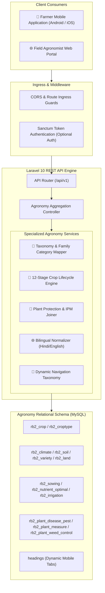

# 🌾 Pragya Crop Advisory — Bilingual AgriTech Intelligence & Operating Platform

> **A high-performance, bilingual (Hindi & English) agricultural advisory operating system and REST API engineered for Pragya NGO to empower rural smallholder farmers.**

[](https://www.php.net/)
[](https://laravel.com/)
[](https://www.mysql.com/)
[](https://restfulapi.net/)
[](https://pragya.org/about-us)
[](https://pragya.org/)

🔗 **Showcase Repository:** [github.com/yashin-chauhan/pragya-crop-advisory](https://github.com/yashin-chauhan/pragya-crop-advisory)

---

## 💡 Problem Context & Business Domain

Smallholder farmers in rural India face critical obstacles in accessing scientific, timely, and actionable agricultural guidance:

* **Language & Terminology Barrier:** Scientific agronomy research is predominantly published in English, excluding Hindi-speaking rural farming communities.
* **Fragmented Information Silos:** Fertilizer dosage (NPK ratios), seed treatment protocols, soil preparation, and irrigation milestones are scattered across disparate portals and brochures.
* **Pest & Disease Devastation:** Fungal infections and pest attacks often cause catastrophic crop failures when farmers lack step-by-step diagnostic and treatment guidance.
* **Unscientific Cultivation Timing:** Sub-optimal sowing depths, improper spacing, and irregular watering schedules reduce crop yield and deplete soil nutrients.

---

## 🚀 The Solution & Platform Architecture

Engineered for **[Pragya NGO](https://pragya.org/about-us)** (an international NGO advancing sustainable development and grassroots community empowerment), the platform delivers verified, stage-by-stage agronomic intelligence to farmers via a modern REST API:



---

## 🧩 Core Platform Subsystems

| Subsystem | Tech Stack | Architectural Function |
| :--- | :--- | :--- |
| **Backend REST API (`pragya-api`)** | Laravel 10.x, PHP 8.1+, MySQL | Transforms complex agronomy tables into high-speed, localized JSON payloads optimized for rural 2G/3G connectivity. |
| **Bilingual Localization Engine** | Devanagari UTF-8 (`utf8mb4`), PHP | Enforces strict language boundaries (`['english', 'hindi']`) and maps dynamic queries to localized database models. |
| **Composite Relational IPM Engine** | Eloquent ORM, MySQL Multi-Table Joins | Unifies disease symptoms, pest lifecycles, and multi-tier chemical/organic remedies into single-request payloads. |
| **Dynamic UI Navigation Taxonomy** | Eloquent Models, Database Registry | Allows agricultural teams to add or reorder mobile app navigation sections dynamically without app-store redeployments. |

---

## 🛡️ Key Engineering Highlights & Invariants

### 1. Composite Relational Joins for Plant Protection
Crop disease and pest management requires correlating visual symptoms (`rb2_plant_disease_pest`) with actionable treatment measures (`rb2_plant_measure`). The backend executes multi-table composite joins, bundling complex remedies into unified single-request payloads to minimize mobile data roundtrips on rural 2G/3G networks.

### 2. Strict Bilingual Localization Invariants
All endpoints enforce strict locale boundaries (`['english', 'hindi']`), mapping queries dynamically to language-partitioned database tables while ensuring Devanagari Unicode (`utf8mb4`) fidelity.

### 3. Dynamic Taxonomy Decoupling
By abstracting navigation headers into dynamic database models, agricultural extension teams can reorder, add, or refine advisory sections without requiring app store updates.

### 4. Global Catch-All Fallback Invariant
All unmapped routes return structured JSON error envelopes, preventing HTML stack traces on mobile clients during unexpected API calls.

---

## 🔌 Core API Endpoints & Response Contracts

### 1. Crop Categories (Types)
* **Endpoint:** `GET /api/croptype/{ln}` (`ln`: `en` | `hi`)
* **Response Sample:**
```json
[
  { "type_name": "Cereals (अनाज)", "type_code": "cereal", "image": "cereal_icon.png" },
  { "type_name": "Pulses (दलहन)", "type_code": "pulse", "image": "pulse_icon.png" }
]
```

### 2. Crop Catalog by Category
* **Endpoint:** `GET /api/cropslist/{ln}/{type}`
* **Response Sample:**
```json
[
  {
    "id": 1,
    "crop_id": "wheat",
    "crop_name": "Wheat (गेहूं)",
    "croptype_code": "cereal",
    "lang": "hindi",
    "image": "wheat.jpg"
  }
]
```

### 3. Topic-Specific Crop Advisory (Composite Diagnostic Payload)
* **Endpoint:** `GET /api/details/{topic}/{ln}/{crop_id}`
* **Supported Topics:** `climate`, `soil`, `variety`, `land`, `treatment`, `sowing`, `nutrient`, `irrigation`, `interculture`, `plant_protection`, `harvesting`, `weather`

---

## 👨‍💻 Engineering Ownership

As the Backend Software Engineer on this project, I was responsible for:
* Architecting and building the complete **Laravel 10 REST API backend (`pragya-api`)**.
* Designing composite query workflows linking agricultural symptoms with chemical/biological remedies.
* Engineering the bilingual localization layer supporting Hindi Devanagari and English datasets.
* Implementing the dynamic mobile navigation taxonomy system.
