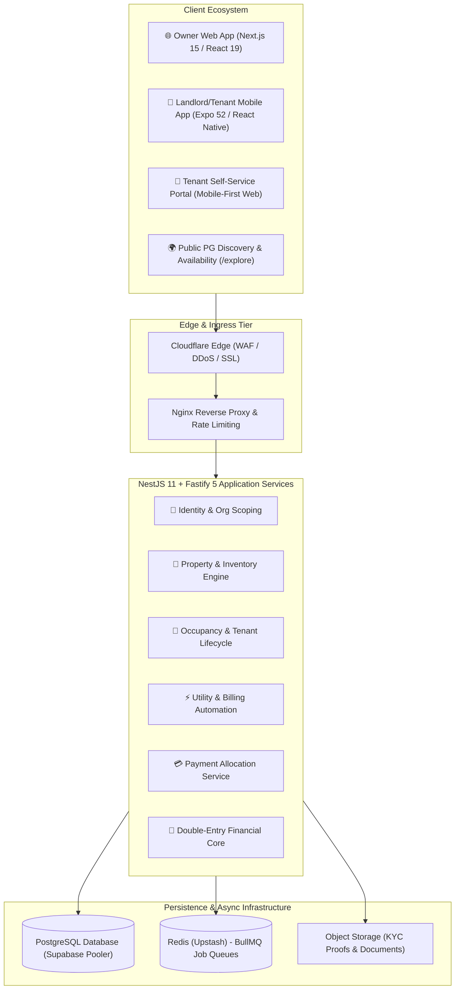

# 🏠 RentKhata — Enterprise PG & Co-Living Operating Platform

> **A multi-tenant, double-entry financial operating system engineered for Indian PG, Co-Living, and Hostel operators.**

🔗 **Showcase Repository:** [github.com/yashin-chauhan/rentkhata](https://github.com/yashin-chauhan/rentkhata)  
🌐 **Live Platform:** [rentkhata.com](https://rentkhata.com/)

---

## 💡 Problem Context & Business Domain

Managing Paying Guest (PG) accommodations, student hostels, and co-living facilities in India involves complex operational and financial challenges:

* **Fragmented Manual Bookkeeping:** Property owners manage properties across physical registers, Excel spreadsheets, and informal WhatsApp chats.
* **Financial Leakage & Ledger Disputes:** Cash and UPI payments lead to unrecorded cashflows, mismatched balances, and deposit refund disputes during checkout.
* **Utility Sub-Meter Inaccuracies:** Manual electricity sub-meter calculation causes tenant-landlord distrust and delayed payments.
* **Tenant Compliance & Verification Bottlenecks:** Physical police verification forms and unverified tenant records pose legal and operational hazards.

---

## 🚀 The Solution & Platform Architecture

RentKhata delivers an enterprise-grade multi-tenant operating platform with strict financial guarantees:

---

## 🧩 Core Platform Subsystems

| Subsystem | Tech Stack | Architectural Function |
| :--- | :--- | :--- |
| **Core API Gateway & Backend** | NestJS 11, Fastify 5, Prisma 7, BullMQ | ESM-native REST API enforcing strict multi-tenancy, OpenAPI 3.0 generation, and async task orchestration. |
| **Owner Dashboard & ERP** | Next.js 15, React 19, Tailwind CSS, TanStack Query | Real-time management interface for property inventories, rent schedules, tenant rosters, and financial audit logs. |
| **Cross-Platform Mobile App** | React Native, Expo SDK 52, NativeWind | On-the-go property operations with biometric authentication, push notifications, and offline-resilient caching. |
| **Tenant Self-Service Portal** | Next.js 15 App Router | Lightweight zero-install web portal for itemized bill tracking, instant UPI rent payments, and digital maintenance tickets. |
| **Public Discovery Hub** | Next.js 15 SSR / ISR | Public room marketplace (`/explore`) featuring verified listings, amenity filters, and instant booking inquiries. |

---

## 🛡️ Key Engineering Highlights & Invariants

### 1. Integer Paise Financial Invariants
To eliminate IEEE-754 floating-point rounding discrepancies across high-volume transactions:
* All financial values (rent, deposits, electricity charges, maintenance, discounts) are strictly calculated and stored in **integer paise** ($\text{₹}1.00 = 100\text{ paise}$).
* Conversions to rupee strings occur only at the final UI rendering boundaries.

### 2. Append-Only Double-Entry Ledger Core
Financial integrity is enforced via a strict double-entry ledger architecture:
* Every financial movement (Rent Invoice Created, Payment Received, Deposit Withheld, Maintenance Surcharge, Checkout Settlement) posts balanced debit and credit entries.
* Historical ledger records are immutable; corrections require compensatory adjustment entries or explicit reversal vouchers.

### 3. Deep Multi-Tenant Inventory Hierarchy
The property domain models a deep hierarchical structure:
$$\text{Organization} \longrightarrow \text{Property} \longrightarrow \text{Floor} \longrightarrow \text{Room} \longrightarrow \text{Bed} \longrightarrow \text{Stay / Tenant}$$
* Dynamic occupancy state machines track vacant, reserved, occupied, and maintenance states with zero race conditions during simultaneous bookings.

### 4. Automated Sub-Meter Utility Billing
* Property managers record initial and final electricity meter readings.
* The system automatically computes per-unit rates, calculates shared room quotas, appends charges directly to monthly tenant invoices, and generates itemized billing breakdowns.

### 5. Strict Organization-Level Data Isolation
* Every query through Prisma ORM is automatically scoped to the session `organizationId`.
* Tenant isolation is enforced at the service level, preventing cross-tenant data leakage.

---

## 👨‍💻 Engineering Ownership

As the Lead Software Architect & Full-Stack Developer, I was responsible for:
* Full-stack architecture, database schema design, and domain modeling.
* Implementation of the NestJS 11 modular backend and Prisma 7 ORM integration.
* Developing the responsive Next.js 15 Owner Dashboard and Tenant Web Portal.
* Engineering the Expo 52 React Native mobile application for Android and iOS.
* Designing the double-entry accounting engine and integer paise calculation pipeline.
* Production deployment on Oracle Cloud Infrastructure behind Cloudflare and Nginx reverse proxy.
