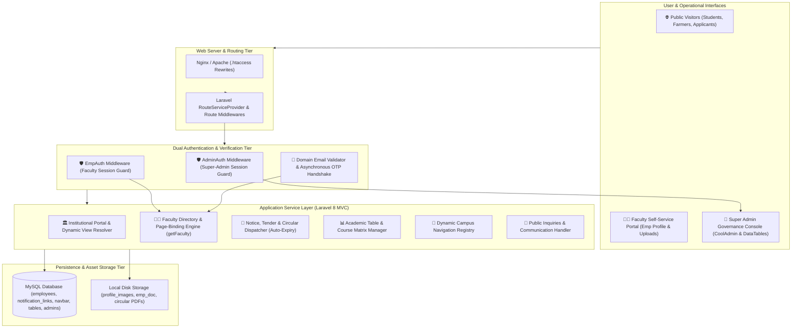

# 🏛️ Dr. YSP University — Institutional Web Portal & Academic Faculty ERP

> **A comprehensive institutional web platform, faculty onboarding portal, and centralized notice & tender management system engineered for Dr. Yashwant Singh Parmar University of Horticulture & Forestry (UHF Nauni, Solan).**

[](https://www.php.net/)
[](https://laravel.com/)
[](https://www.mysql.com/)
[](https://getbootstrap.com/)
[](https://jquery.com/)
[](https://datatables.net/)
[](https://codeseven.github.io/toastr.js/)

🌐 **Live Institutional Portal:** [uhf.ac.in](https://uhf.ac.in/)

---

## 💡 Problem Context & Business Domain

State agricultural and forestry universities with multi-campus structures (spanning horticulture colleges, forestry institutes, regional research stations, and Krishi Vigyan Kendras / KVKs across high-altitude and valley zones) face critical communication and administrative challenges:

* **Decentralized Faculty Directory Management:** Faculty profiles, research specializations, and departmental affiliations were scattered across paper registers and static webpages, making updates slow and error-prone.
* **Unverified Profile Updates:** Public staff registries risked unauthorized profile modifications or duplicate registrations without domain validation or OTP challenges.
* **Manual Notice Expiry & Circular Clutter:** Academic circulars, procurement tenders, employment notices, and agro-advisories lingered on university pages long after submission deadlines, confusing students and applicants.
* **Multi-College & Multi-Station Information Silos:** Connecting 4+ constituent colleges, 5+ Regional Research Stations (RHR&TS), and 5+ KVK extension centers under a unified dynamic navigation tree required custom CMS architecture.
* **Static Course Catalogs & Curriculum Tables:** Academic departments struggled to maintain semester course matrices and credit-hour tables without hardcoded code deployments.

---

## 🚀 The Solution & Platform Architecture

The YSP University Platform provides a full-stack, unified academic governance, faculty self-service ERP, and dynamic institutional information portal:



---

## 🧩 Core Platform Subsystems

| Subsystem | Tech Stack | Architectural Function |
| :--- | :--- | :--- |
| **Faculty Onboarding & OTP Engine** | Laravel 8, PHP Mailer, jQuery AJAX, Toastr | Validates professional institutional emails, issues session-bound OTPs, and registers verified faculty profiles. |
| **Faculty Directory & Page Binder** | Blade, MySQL, Helper Functions (`getFaculty`) | Dynamically renders active faculty profiles into college and departmental sub-pages without template changes. |
| **Notice & Tender Dispatcher** | Eloquent ORM, Query Builder, Storage API | Publishes classified circulars, tenders, and job vacancies with automated last-date expiration filters. |
| **Dynamic Academic Table Manager** | Laravel 8 MVC, Blade, DataTables | Admin-controlled CRUD for course syllabi, credit-hour matrices, and departmental curriculum tables. |
| **Campus Navigation Engine** | MySQL `navbar` Schema, Blade Macro Views | Database-backed multi-level navigation tree for colleges, research stations, and KVK centers. |
| **Public Institutional Portal** | Blade, Bootstrap 4, Owl Carousel, Magnific Popup | Responsive university web experience covering admissions, research mandates, and student services. |
| **Admin Governance Console** | CoolAdmin Theme, DataTables 1.13, Toastr.js | Centralized portal for faculty approvals, AJAX status toggling, notification publishing, and messaging. |

---

## 🛡️ Key Engineering Highlights & Invariants

### 1. Asynchronous Institutional Domain Email & OTP Verification
To ensure only legitimate university personnel register faculty profiles, the system performs a multi-stage challenge before account creation:
1. **Institutional Domain Enforcement:** The email domain is verified against authorized patterns (`@tingebharat.com` / university domain).
2. **AJAX Pre-Flight Duplicate Check:** Checks existing database records to prevent duplicate email registrations.
3. **Session-Bound OTP Challenge:** Generates a cryptographically randomized numeric OTP, transmits it via email, and validates the handshake in session state prior to executing the database `INSERT`.

### 2. Dynamic Faculty Page Binding via Helper Architecture
Rather than duplicating faculty records across dozens of departmental views, faculty accounts store a target `page` identifier (e.g., `cohft-facu`). The centralized helper `getFaculty($page)` executes an optimized query:
```php
function getFaculty($page) {
    return DB::table('employees')
        ->where('page', $page)
        ->where('status', 1)
        ->get();
}
```
* Admins can dynamically reassign faculty across college pages in real time without code modifications or redeployments.

### 3. Automated Notice & Tender Expiry Lifecycle
Public tenders, job openings, and student notices automatically disappear once their submission deadlines pass:
```php
$yesterday = date('Y.m.d', strtotime("-1 days"));
$links = DB::table('notification_links')
    ->where(function($query) use ($yesterday) {
        $query->whereNull('last_date')
              ->orWhere('last_date', '>', $yesterday);
    })
    ->orderBy('id', 'desc')
    ->get();
```

### 4. Real-Time AJAX Status Toggling
Super-admins can toggle faculty profiles between `Active` and `Deactivated` states via asynchronous AJAX calls (`/admin/statusUpdate`), instantly updating the UI state with zero full-page reloads.

---

## 👨‍💻 Engineering Ownership

As the Full-Stack Software Engineer on this project, I was responsible for:
* Architecting the end-to-end web portal and ERP backend using **Laravel 8 and MySQL**.
* Engineering the asynchronous faculty self-onboarding system featuring institutional domain filtering and email OTP verification.
* Designing the dynamic page-binding architecture (`getFaculty($page)`) to link faculty credentials across college portals.
* Developing the dynamic auto-expiry notice engine for university tenders, job recruitments, and academic circulars.
* Building the Super Admin governance dashboard with dynamic DataTables, AJAX status toggles, and dynamic academic table editors.
* Structuring the multi-campus navigation tree representing 4 constituent colleges, 5 research stations, and 5 extension centers (KVKs).
